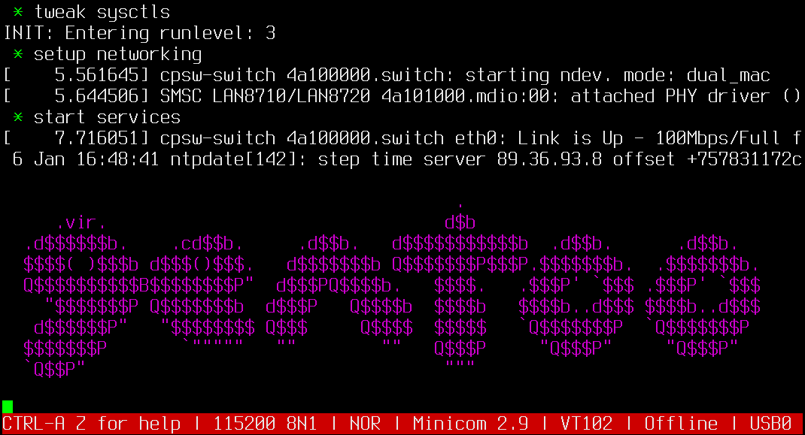

## Peter's Exquisite Ebuild Collection

An overlay that contains ebuilds for my open-source projects and a safe heaven for packages that were ruthlessly axed from the main Gentoo portage tree.

### setup

recommended ```/etc/portage/repos.conf/peec.conf``` configuration:

```
[peec]
location = /var/db/repos/peec
sync-type = git
sync-uri = https://github.com/rodan/overlay.git
sync-git-verify-commit-signature = yes
sync-openpgp-key-path = /usr/share/openpgp-keys/petrerodan.gpg
```

My gnupg key is available via [WKD](https://wiki.gnupg.org/WKD) [here](https://openpgpkey.subdimension.ro/.well-known/openpgpkey/subdimension.ro/hu/w6rzxnjwt1aag7tjxgi19j844woafo1j?l=petre.rodan).

### highlights

package | details
--- | ---
[app-admin/laboule](https://github.com/rodan/laboule) | iptables-based banning helper daemon
[app-dicts/dicpoli](https://github.com/rodan/dictionar_poliglot_de_aeronautica) | multilingual aeronautical dictionary compatible with dictd, stardict and kindle (de en es fr it ro) 3759 terms
[dev-embedded/atlas430](https://github.com/rodan/atlas430) | library of HAL functions for MSP430 microcontrollers
[dev-embedded/msp430-gcc-bin](https://www.ti.com/tool/MSP430-GCC-OPENSOURCE) | open source toolchain for MSP430 microcontrollers
[games-engines/mcarpet2](https://github.com/rodan/magic_carpet_2) | recode of Buffrog's Magic Carpet 2 game now with OpenAL-based directional sounds and support for modern controllers and joysticks
[media-gfx/thpp](https://github.com/rodan/thpp) | thermal processing panel - viewer and analyzer of infrared images compatible with FLIR and IRTIS cameras
[net-misc/iotcpd](https://github.com/rodan/iotcpd) | a stdio to tcp redirector daemon
[sys-apps/cwiticald](https://github.com/rodan/cwiticald) | entropy gathering daemon for TrueRNG devices
[sci-electronics/sigdup](https://github.com/rodan/sigdup) | software that takes PulseView digital signal captures as input and re-plays them on the pins of a MSP430FR5994 (up to 8 channels)
[sys-process/daemontools-scripts](https://github.com/rodan/daemontools-scripts) | Gentoo specific daemontools wrapper scripts
[app-admin/authprogs](https://github.com/11001100/authprogs) | ssh forced command wrapper
[app-portage/epm](https://github.com/fuzzyray/epm) | rpm workalike for Gentoo Linux
[net-firewall/shorewall](https://shorewall.org/) | patchset that fixes egrep, fgrep obsolescence. ticket is [here](https://bugs.gentoo.org/923441)
[sys-apps/linux-misc-apps](https://kernel.org/) | misc tools bundled with kernel sources
dev-python/* | dependencies for kernel's make dt_binding_check


